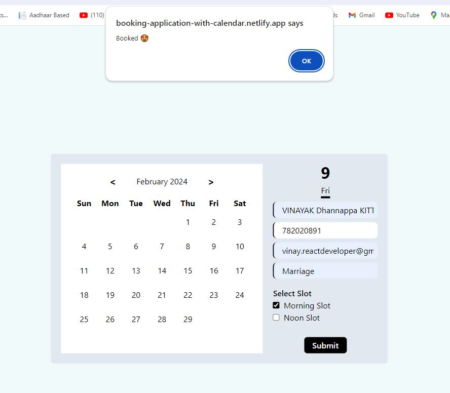

# Booking Application with Calendar

## Project Overview

This project involves the creation of a Booking App with an interactive calendar to showcase venue availability. The app is built using React.js, Vite, and Redux. It features a user-friendly calendar display, booking functionality for half-day slots, and a simple booking form with essential details. The booking procedure is streamlined with a popup window for confirming reservations.

## Deployment

The application is deployed on Netlify. You can access it [here](https://booking-application-with-calendar.netlify.app/).

## Tech Stack

- React.js
- Vite
- Redux
- Tailwind CSS
- VS Code

## Features Implemented

1. **Interactive Calendar:**
   - User-friendly display of venue availability for each day.
   - Clearly distinguishes booked dates and available slots.
   - Tabs for easy navigation between months and years.

2. **Booking Functionality:**
   - Half-day slot options for user flexibility.
   - Intuitive calendar UI for reference.
   - "Book" button triggers a popup window with a booking form.

3. **Booking Form:**
   - Captures essential details:
     - Slot Selection: First Half / Second Half.
     - User details (name, contact information).
     - Purpose of booking/Event name (e.g., wedding, conference).

4. **Booking Procedure:**
   - Utilizes the calendar UI for reference.
   - "Book" button triggers a popup window with the booking form.
   - Includes a "Confirm Booking" button within the popup for finalizing reservations.

## Implementation Details

The project has been implemented with the following features:

- Calendar display with React.js and Vite.
- Form validation for capturing accurate details.
- Interactive calendar with previous booking details.

## Screenshots

### Step 1

### Step 2

### Step 3

### Step 4

### Step 5

### Step 6

### Step 7

### Step 8

### Step 9

### Step 10

### Step 11

### Step 12

### Step 13

